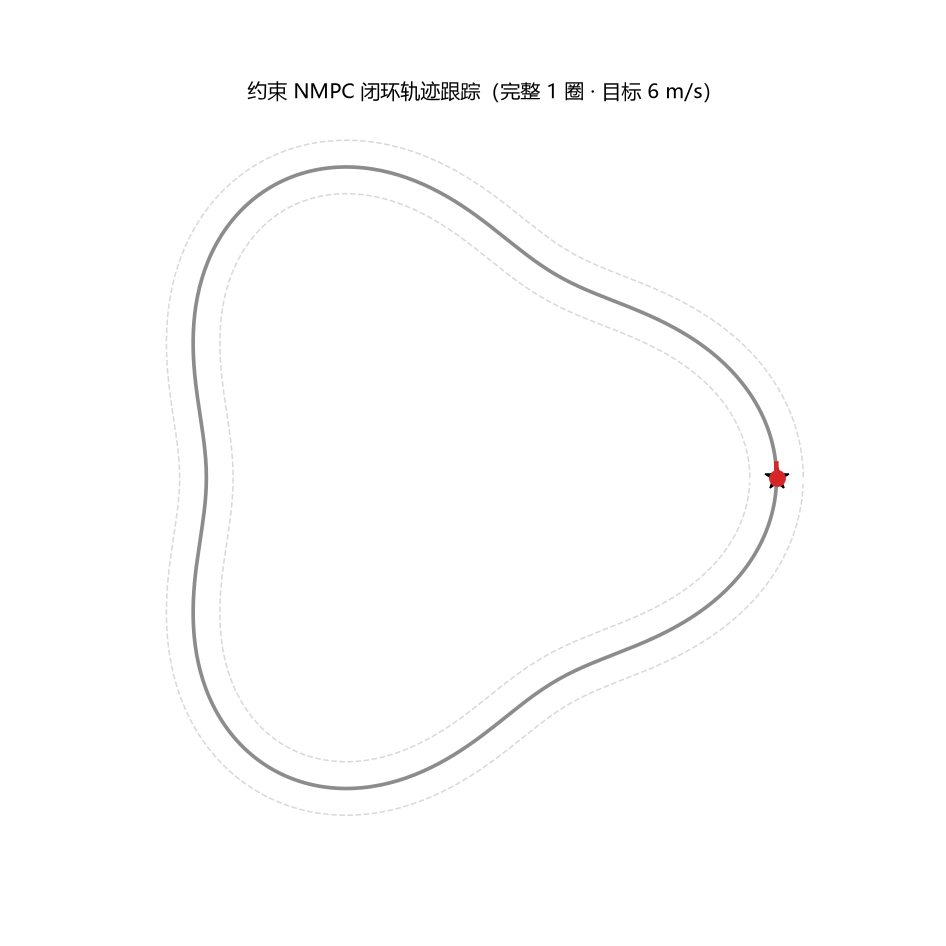
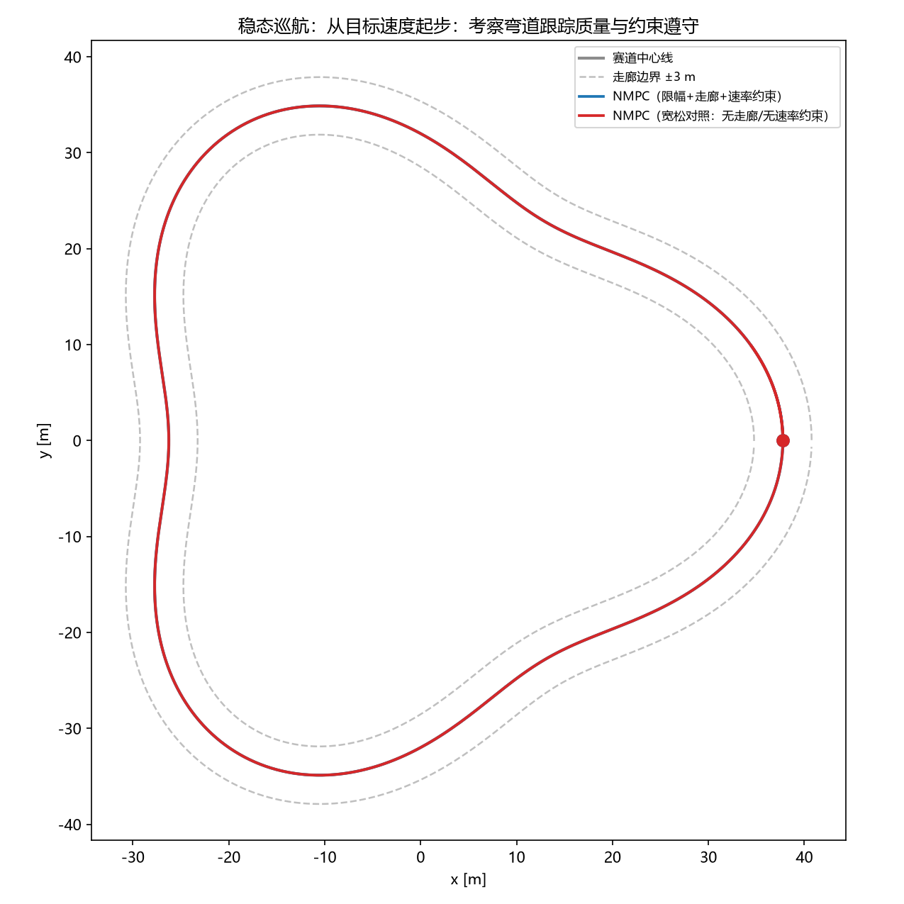

# MPC 车辆轨迹跟踪实践

从"模型推导"到"闭环验证"的**非线性模型预测控制（NMPC）**完整实现：
基于**运动学自行车模型**与**参数化变曲率闭环赛道**，用 CasADi + IPOPT 自建
**路径跟踪 NMPC**，并配套对照实验、自动验证与求解器基准。

- 控制器特性：**路径坐标代价**、**横向走廊硬约束**、**转向速率约束**、**松弛变量软约束**、热启动
- 4 个闭环场景 × 2 种控制器配置对照：稳态巡航 / 起步瞬态 / 偏移恢复 / 模型失配
- `verify.py` 提供 **12 项自动验证**（正确性 + 约束遵守 + 文档引用），当前全部通过
- `benchmark_solvers.py` 对比 4 个 NLP 求解器（IPOPT / fatrop / sqpmethod / qrsqp）
- Windows / Linux / macOS 均可运行，无 GPU 需求

## 项目结构

```
MPC/
├── vehicle-nmpc-tracking/        # 主项目（含独立 README 与完整实现）
│   ├── model.py                  # 运动学自行车模型 + RK4（numpy 快路径 / CasADi 符号路径）
│   ├── track.py                  # 闭环赛道生成 + 最近点/横向误差查询
│   ├── mpc.py                    # NMPC：路径坐标代价、走廊/速率/松弛约束、多求解器
│   ├── simulate.py               # 4 场景闭环仿真主程序（argparse + 数据缓存 + 出图）
│   ├── verify.py                 # 12 项自动验证（回归测试 + 文档引用检查）
│   ├── benchmark_solvers.py      # 求解器基准对比
│   ├── animation.py              # 绕赛道动画 GIF（读缓存数据）
│   ├── requirements.txt
│   ├── docs/notes-mpc.md         # 技术笔记：推导 / 约束设计 / 验证清单 / 局限
│   └── results/                  # 输出图、数据、配置、基准结果
├── README.md                     # 本文件
└── .gitignore
```

## 快速开始

```bash
cd vehicle-nmpc-tracking
pip install -r requirements.txt

python simulate.py            # 跑 4 个场景：终端统计 + results/ 出图 + 数据缓存
python verify.py              # 自动验证（11 项）
python animation.py           # 生成绕赛道动画 GIF
python benchmark_solvers.py   # 求解器基准对比
```

## 结果预览



*约束组跑完整 1 圈（目标 6 m/s，虚线为走廊边界）*



*稳态巡航：约束组与宽松对照的轨迹（两者都贴线，差别在控制量是否物理可行）*


*起步瞬态：约束组的加速度恰好贴在 3 m/s² 限幅上，宽松对照冲到 10 m/s²（不可执行）*

## 关键实测指标

| 场景 | 横向误差峰值 | 加速度峰值 | 说明 |
|---|---|---|---|
| 稳态巡航 | 0.014 m | 0.42 m/s² | 厘米级跟踪；转向速率约束为主动约束 |
| 起步瞬态 | 0.012 m | 3.00 m/s²（贴限幅） | 对照配置给出 10.0 m/s²，物理不可行 |
| 偏移恢复 | 2.50 m（初始） | 3.00 m/s² | 硬约束不可行 → 松弛变量吸收 1.0 m 越界后收敛回走廊 |
| 模型失配 | 0.044 m | 0.42 m/s² | 真实轴距比模型大 20%，反馈仍压在厘米级 |

实时性：IPOPT 单步求解均值 **8.9 ms**（控制周期 100 ms，**实时余量 11×**）。
完整指标、图表与求解器对比见 [vehicle-nmpc-tracking/README.md](vehicle-nmpc-tracking/README.md)。

