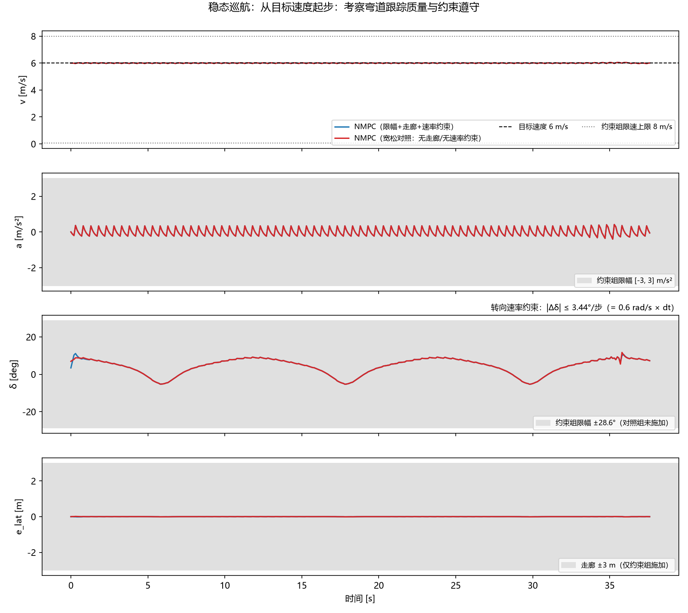
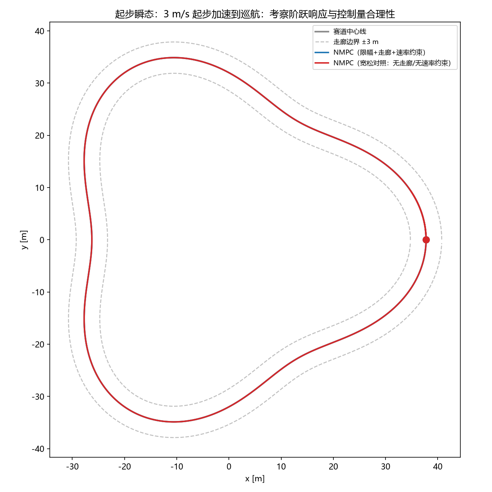
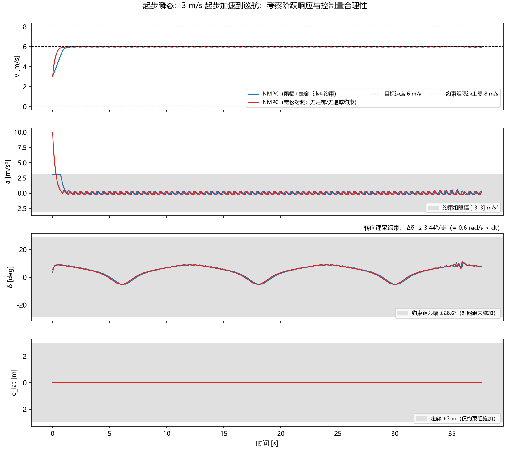
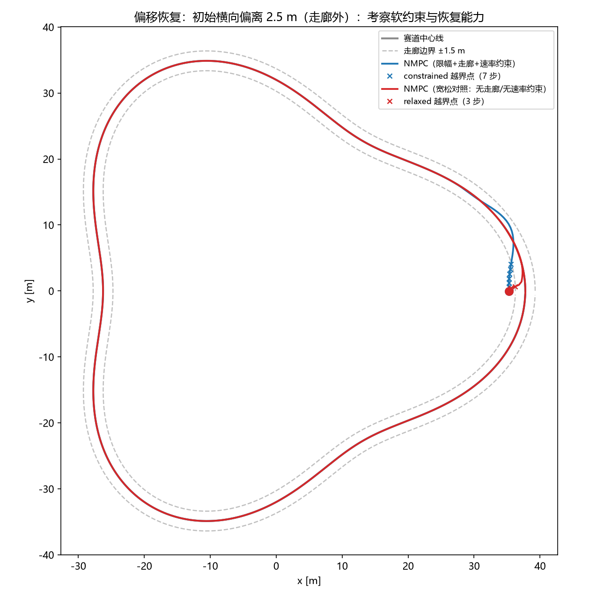
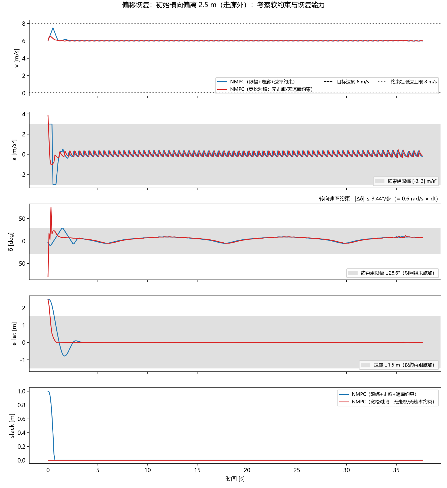
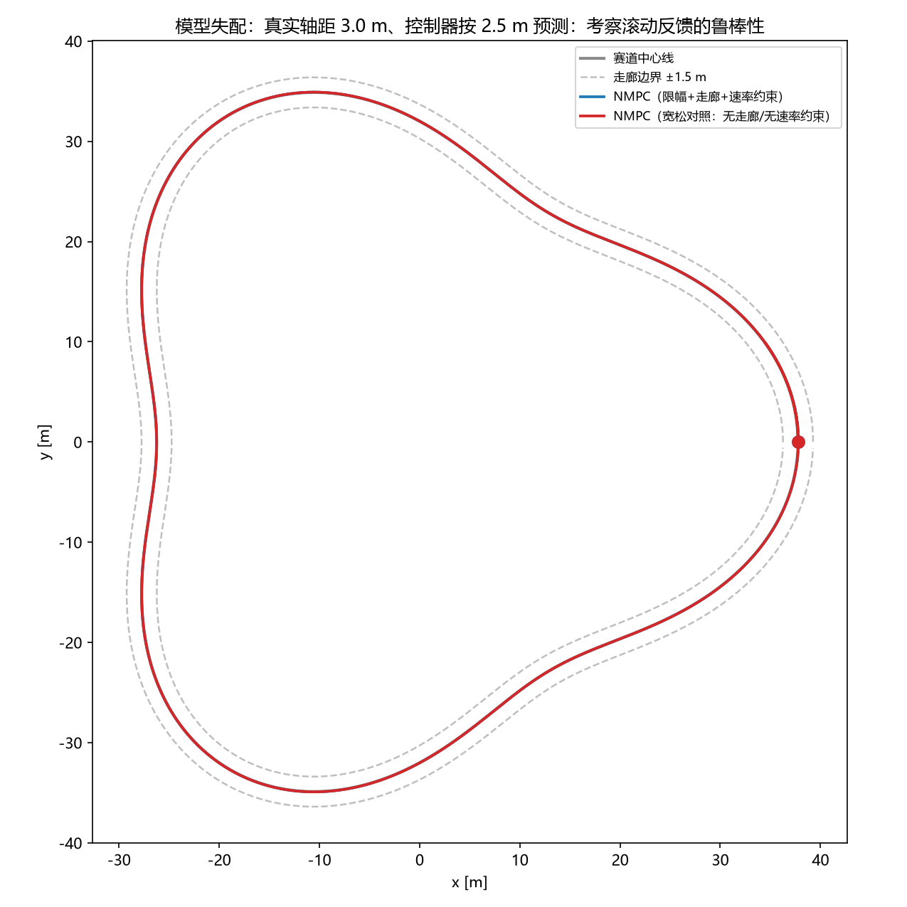
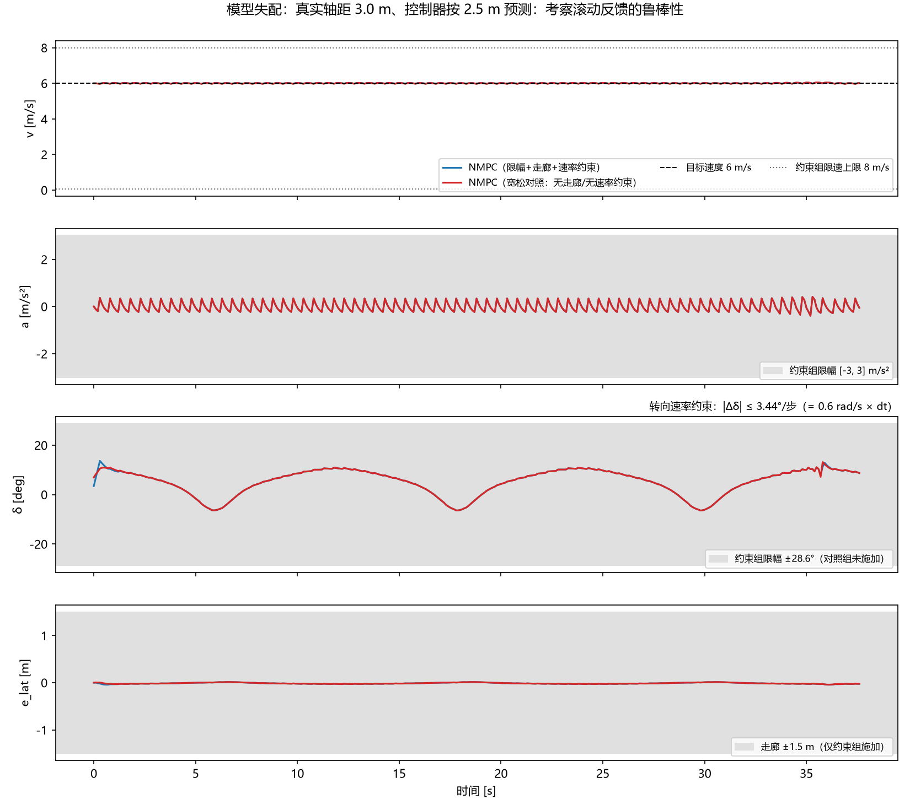

# 车辆 NMPC 轨迹跟踪（Vehicle NMPC Trajectory Tracking）

> 一个"从推导到验证"的**非线性模型预测控制（NMPC）**完整实践项目：
> 让一辆**运动学自行车模型**车辆在**变曲率闭环赛道**上自动跟踪中心线巡航。
> 全部代码中文注释、一键复现，附带 4 个闭环场景对比、自动验证脚本与求解器基准。

## 项目亮点

- **从零推导**车辆运动学模型（状态空间 + RK4 离散），不依赖任何黑盒车辆仿真器；
  `rk4_step` 同时提供 numpy 数值路径（推进"真车"）与 CasADi 符号路径（构造 MPC 约束）
- 用 **CasADi Opti + IPOPT** 自建路径跟踪 NMPC：
  **路径坐标代价**（横向/纵向解耦）、**横向走廊硬约束**、**转向速率约束**、
  **松弛变量软约束**、热启动加速
- **4 个闭环场景 × 2 种控制器配置**对照实验：稳态巡航 / 起步瞬态 / 偏移恢复 / 模型失配
- **`verify.py`**：把 12 项正确性与约束检查固化成可执行回归测试（含"不盲信求解器状态"的独立核验，以及 Markdown 图片/链接引用检查）
- **`benchmark_solvers.py`**：对比 IPOPT / fatrop / sqpmethod / qrsqp；
  实测结论：OCP 专用求解器在本问题上**反而更慢**（原因见下文"求解器对比"）
- 工程细节完整：Windows CasADi 插件路径自动修复、求解失败兜底、数据缓存复用、局部窗口最近点搜索

## 问题背景

自动驾驶与机器人里最常见的控制任务之一：**给定参考路径，让车贴着它走**。
难点在于：

1. 车辆有物理限制（转向幅值、转向速率、加速度、速度范围）；
2. 必须"看得远"——提前感知弯道才能平顺跟踪；
3. 不能压线出界（这是**硬约束**，不是"尽量别压"）。

MPC 正是为此而生：每个控制周期求解一个有限时域最优控制问题，
**只执行第一个控制量**，下一周期带着新的实测状态重新求解（滚动时域 + 反馈）。

## 系统模型

状态（后轴中心）：$s = [p_x,\ p_y,\ \psi,\ v]^T$，控制：$u = [a,\ \delta]^T$

$$
\dot p_x = v\cos\psi,\quad
\dot p_y = v\sin\psi,\quad
\dot \psi = \frac{v}{L}\tan\delta,\quad
\dot v = a
$$

$L=2.5\text{m}$ 为轴距；推导过程与假设（低速、无侧滑）见 `model.py` 头部注释与 `docs/notes-mpc.md`。
仿真与 MPC 内部均用 **RK4** 以 $dt=0.1\text{s}$ 离散（局部误差 $O(dt^5)$，远优于欧拉）。

## 控制器：路径跟踪 NMPC

每个控制周期求解（$N=25$ 步预测时域 = 2.5 s）：

$$
\min_{s_{0:N},u_{0:N-1}}\ \sum_{k=0}^{N-1}\Big[
q_{lat}e_{lat,k}^2+q_{lon}e_{lon,k}^2
+q_\psi(1-\cos e_{\psi,k})+q_v e_{v,k}^2
+r_a a_k^2+r_\delta \delta_k^2\Big]
+\ \text{终端代价（权重 ×2）}
$$

其中误差**投影到参考路径的切向/法向**（路径坐标，而非笛卡尔坐标）：

$$
e_{lon}= \cos\psi_r\,\Delta x+\sin\psi_r\,\Delta y,\qquad
e_{lat}= -\sin\psi_r\,\Delta x+\cos\psi_r\,\Delta y
$$

**约束体系**：

| 约束 | 形式 | 作用 |
|---|---|---|
| 初始状态 | $s_0 = s(t)$ | 预测必须从实测状态出发（漏掉会让车"从梦里出发"） |
| 动力学 | $s_{k+1}=f_{RK4}(s_k,u_k)$ | 预测符合车辆模型 |
| 执行器幅值 | $a\in[-3,3]$、$\delta\in[-0.5,0.5]$ | 实车物理限幅 |
| 速度 | $v\in[0.05,8]$ | 防倒车/原地转 |
| **横向走廊** | $\lvert e_{lat}\rvert\le w/2$（或 $+s_k$） | MPC 相对 PID/LQR 的本质优势：显式硬约束 |
| **转向速率** | $\lvert\delta_k-\delta_{k-1}\rvert\le\dot\delta_{max}dt$ | 执行器速率限制（含跨周期衔接） |
| **松弛变量** | $s_k\ge0$，重罚 $\rho s_k^2$ | 走廊外初值下硬约束不可行 → 软约束保证可解 |

三个关键设计决策（以及踩过的坑）见 `docs/notes-mpc.md`：

1. **为什么用路径坐标代价**：早期版本直接惩罚笛卡尔位置误差，把"沿路径进度"和"横向偏差"混在一起；
   起步时参考点以 6 m/s 跑掉而车只有 3 m/s，优化器只能"满油门 + 猛打方向切弯追赶"，
   起步一拍出现 **25.8°** 的异常转角；改为路径坐标后降到 **10.9°**；
2. **为什么航向用 $1-\cos$**：角度是周期量，二次惩罚在 ±π 处跳变；
   实测车辆 ψ 累计 1.24 圈（>2π），二次惩罚会与参考航向差 2π 而失配；
3. **为什么需要松弛变量**：初始已在走廊外时硬约束**第一拍就不可行**
   （`verify.py` 第 7 项把这个现象固化成"期望失败"的检查）。

## 场景设计（4 × 2 对照实验）

| 场景 | 设置 | 考察点 |
|---|---|---|
| `steady` 稳态巡航 | 从目标速度 6 m/s 起步 | 弯道跟踪质量、约束是否被尊重 |
| `startup` 起步瞬态 | 3 m/s 起步加速到 6 m/s | 阶跃响应、控制量是否物理可行 |
| `recovery` 偏移恢复 | 初始横向偏离 2.5 m（走廊 ±1.5 m 之外） | 软约束 + 恢复能力 |
| `mismatch` 模型失配 | 真实轴距 3.0 m，控制器按 2.5 m 预测 | 滚动反馈的鲁棒性 |

每个场景跑两种控制器：**约束组**（实车限幅 + 走廊 + 速率约束）与
**宽松对照**（限幅放宽到 ±10 m/s²、±1.4 rad，无走廊、无速率约束）。

## 结果

### 汇总指标

| 场景 | 控制器 | 横向误差峰值 | 走廊越界步数 | 加速度峰值 | 转角峰值 | 求解均值 |
|---|---|---|---|---|---|---|
| steady | **约束组** | **0.014 m** | 0 | 0.42 m/s² | 11.1° | 11.9 ms |
| steady | 宽松对照 | 0.014 m | 0 | 0.42 m/s² | 11.7° | 18.0 ms |
| startup | **约束组** | **0.012 m** | 0 | **3.00 m/s²（贴限幅）** | 10.9° | 22.5 ms |
| startup | 宽松对照 | 0.013 m | 0 | **10.0 m/s²（超实车限幅 3 倍）** | 11.3° | 18.6 ms |
| recovery | **约束组** | 2.50 m（初始） | 7（初始越界，slack = 1.0 m） | 3.00 m/s² | 28.4° | 46.6 ms |
| recovery | 宽松对照 | 2.50 m（初始） | 3 | 3.86 m/s² | **78.9°（不可执行）** | 18.0 ms |
| mismatch | **约束组** | **0.044 m** | 0 | 0.42 m/s² | 13.7° | 20.8 ms |
| mismatch | 宽松对照 | 0.041 m | 0 | 0.42 m/s² | 13.2° | 17.6 ms |

### 结果解读

- **稳态精度达到厘米级**（峰值 1.4 cm，赛道半宽 3 m）：设计余量充足；
  也说明**标称工况下走廊约束不会激活**——约束的价值要到瞬态/扰动/失配场景里看；
- **转向速率约束是"主动约束"**：稳态巡航时 $\lvert\Delta\delta\rvert$ 恰好贴在
  $0.6\,\text{rad/s}\times dt = 0.06$ rad/步 的上限，说明该限制真实塑造了控制行为；
- **起步瞬态**：约束组加速度恰好 3.00 m/s²（饱和 = 约束激活），
  宽松对照给出 10.0 m/s²——**物理上执行不了的指令**，这正是约束的意义；
- **偏移恢复**：硬走廊在此场景不可行，软约束用 slack 记录初始 1.0 m 越界，
  随后车辆回到走廊内（后 25% 的最大横向误差 **0.009 m**）；
  宽松对照用 78.9° 转角和 1.67 rad/步 的转向速率"硬掰"回来——远超实车能力；
- **模型失配**：真实轴距比模型大 20% 时，横向误差峰值从 0.014 m 增至 0.044 m，
  仍在厘米级——**每拍重解 + 状态反馈吸收了模型误差**。

### 可视化


*动画：约束组在闭环赛道跑完整 1 圈（目标 6 m/s；虚线为走廊边界）*

| 场景 | 轨迹对比 | 时序对比 |
|---|---|---|
| 稳态巡航 |  |  |
| 起步瞬态 |  |  |
| 偏移恢复 |  |  |
| 模型失配 |  |  |

时序图的 4~5 行分别是：速度、加速度、转角、横向误差（软约束场景额外画松弛变量）。
图中灰色条带是**约束组的限幅**（对照组未施加），可直接看出对照组越界。

## 自动验证（`verify.py`）

把"实现是否正确、是否真守约束"固化成 12 项检查，改动代码后一跑就知道有没有改坏：

| # | 检查项 |
|---|---|
| 1 | 求解成功 + 初始状态约束 $s_0=x_0$（早期版本漏掉此约束导致横向偏差 124 m） |
| 2 | 动力学一致性：逐点 $s_{k+1}=f_{RK4}(s_k,u_k)$ |
| 3 | 限幅满足（预测时域内的**优化解本身** + 闭环执行量） |
| 4 | 横向走廊全程不越界 |
| 5 | 转向速率（含与上一拍的跨周期衔接） |
| 6 | 软约束恢复：slack 吸收越界 → 收敛回走廊 |
| 7 | 硬走廊 + 走廊外初值 → 期望不可行（说明为何需要松弛变量） |
| 8 | 模型失配下误差仍被压在 0.10 m 内 |
| 9 | 标称运行 100% 求解成功 |
| 10 | **Markdown 图片/链接引用均有效**（防止改了输出文件名后 README 图片挂掉） |

```bash
python verify.py          # 快速档（约 600 次求解）
python verify.py --full   # 完整一圈，发布前检查
```

当前状态：**12/12 全部通过**。

## 实时性与求解器对比

`benchmark_solvers.py` 在**同一问题**（N=25、走廊 + 速率约束）上比较 4 个求解器，
协议：闭环 150 步、前 20 步热机不计入（本机一次运行结果，机器负载不同会有波动）：

| 求解器 | 单步均值 | p95 | 实时余量（控制周期 100 ms） |
|---|---|---|---|
| **IPOPT** | **8.9 ms** | 10.5 ms | **11.2×** |
| sqpmethod | 10.3 ms | 16.6 ms | 9.7× |
| qrsqp | 10.7 ms | 16.5 ms | 9.3× |
| fatrop | 42.3 ms | 55.6 ms | 2.4× |

**为什么面向最优控制问题的专用求解器（fatrop）反而更慢？**
它依赖标准 OCP 结构（阶段变量、仅相邻阶段耦合）做稀疏分解；
本项目为真实性加入了 $\lvert\delta_k-\delta_{k-1}\rvert$ 的**跨阶段耦合约束**，
破坏了该结构，专用求解器因此失去优势。**结论：求解器选型必须用实际问题的结构去测。**
（`sqpmethod` / `qrsqp` 会打印迭代日志，其输出通道无法用 fd 重定向屏蔽，属正常现象。）

## 工程细节

- **Windows CasADi 插件路径修复**：CasADi ≥3.7 在 Windows 上加载 IPOPT 插件时
  不搜索自身目录，会报 `Plugin 'ipopt' is not found / WIN32 126`；
  `mpc.py` 在**当前进程内**把包目录补进 PATH（不修改系统环境，进程结束即失效）；
- **不盲信求解器状态**：IPOPT 返回 `Solve_Succeeded`，fatrop 返回 `'0'`；
  `NMPC._solution_ok()` 独立核验"数值有效 + 满足限幅 + 逐点满足动力学"，
  三项都过才算成功，否则丢弃热启动缓存并触发兜底；
- **求解失败兜底**：单步失败不再中断整个仿真，而是保持上一拍控制量并计数；
- **数据缓存**：`simulate.py` 把每次运行存成 `results/<scenario>_data.npz`，
  `animation.py` 直接读缓存出图，避免重复求解、保证图与数据同源；
- **性能**：`rk4_step` 数值路径为纯 numpy（避免每步构造 CasADi 对象）；
  最近路点查询用进度提示做局部窗口搜索，跑出窗口自动回退全量搜索。

## 快速开始

```bash
pip install -r requirements.txt

python simulate.py                     # 跑全部 4 个场景：出图 + 数据 + run_config.json
python simulate.py --scenario steady   # 只跑稳态场景
python simulate.py --quick             # 快速模式（0.4 圈，调参用）
python simulate.py --vref 7 --horizon 30 --delta-rate 0.8   # 改参数

python verify.py                       # 自动验证（11 项）
python benchmark_solvers.py            # 求解器基准对比
python animation.py                    # 生成绕赛道动画 GIF（读缓存数据）
```

输出目录 `results/`：`<scenario>_track.png`、`<scenario>_timeseries.png`、
`<scenario>_data.npz`、`run_config.json`、`solver_benchmark.md`、`animation.gif`。

## 目录结构

```
vehicle-nmpc-tracking/
├── model.py              # 运动学自行车模型 + RK4（numpy 快路径 / CasADi 符号路径）
├── track.py              # 闭环赛道生成 + 最近点/横向误差查询（局部窗口加速）
├── mpc.py                # NMPC：路径坐标代价、走廊/速率/松弛约束、多求解器支持
├── simulate.py           # 4 场景闭环仿真主程序（argparse + 数据缓存 + 出图）
├── verify.py             # 11 项自动验证（回归测试）
├── benchmark_solvers.py  # 求解器基准对比
├── animation.py          # 绕赛道动画 GIF（读缓存数据）
├── requirements.txt
├── LICENSE               # MIT
├── docs/notes-mpc.md     # 技术笔记：推导 / 约束设计 / 验证清单 / 局限
└── results/              # 输出图、数据、配置、基准结果
```

## 局限与后续工作

- 运动学模型无侧偏/轮胎力限制，高速（>10 m/s）不适用 → 升级为动力学模型（侧偏角 + 轮胎模型）；
- 仿真世界理想（无噪声、无执行器动态/延迟）→ 加入传感器噪声、执行器一阶动态、坡度扰动；
- 硬约束只保证**预测模型内**可行：模型失配时实际轨迹仍可能越界（见 mismatch 场景）
  → 严格保证需要 tube MPC / 鲁棒 MPC；
- 参考轨迹来自赛道中心线，没有感知与规划层 → 可接入路径规划构造"避障 + 跟踪"完整链路；
- 权重手工整定 → 可引入自动调参（贝叶斯优化 / 自适应权重）。

## 许可

MIT License，见 [LICENSE](LICENSE)。
